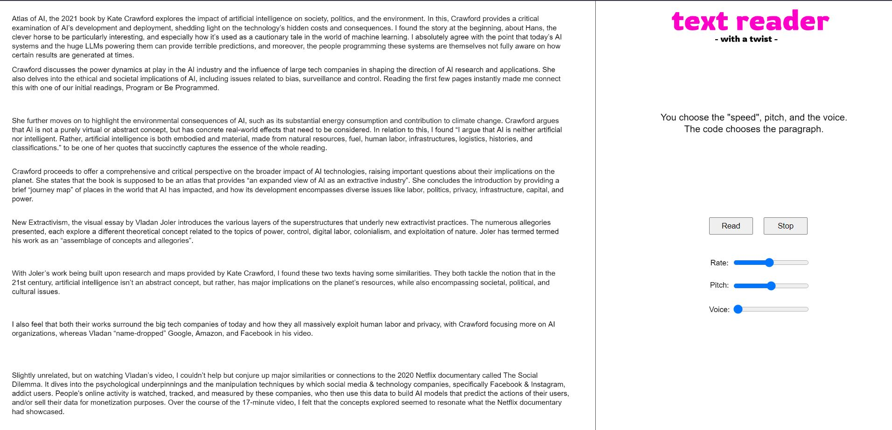
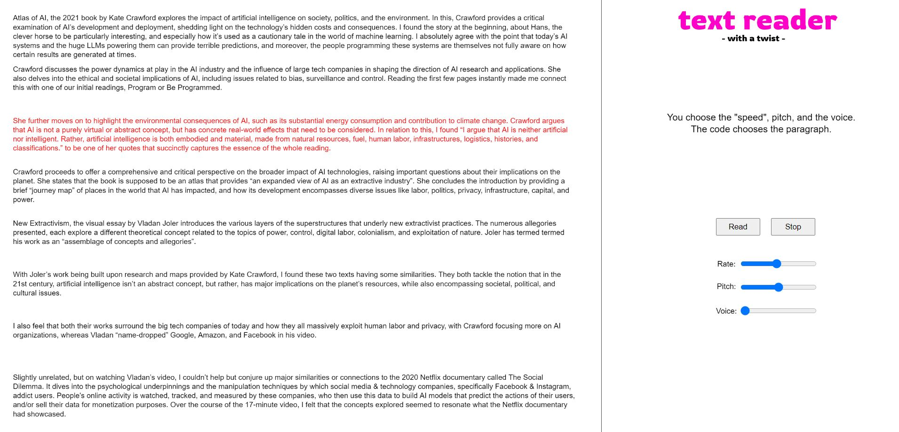

# ReadMe - HW09 Working Document

For this assignment, I've made use of **p5.Speech**: https://idmnyu.github.io/p5.js-speech/

⚠️⚠️ *Please use the **STOP** button to cut the spoken text mid-way. There's some issue with the library wherein speech synthesis cuts off after a few seconds of continuous synthesis, and then takes 3-4 refreshes to re-initialize (or maybe it's just a Chromium+Windows issue)* ⚠️⚠️

❗❗ **LIBRARY CHOICE & IDEA** ❗❗

I've implemented a "TalkBack" text-reader but with a rather quirky twist. Given any passage, the user interacting with the interface can decide which *voice* the reader would take, and what *rate* and *pitch* values would the respective voice operate with.

To give a more "encapsulating" spin to this assignment, I figured I'd just let the text-reader skim through my own responses for this week's *Read & Respond* task. The quirkiness comes from the fact that the text-reader won't go *sequentially*. I've coded in a small snippet that'll randomly generate a paragraph number that would be read out when the user clicks the "Read" button. I've provided sliders to manipulate the speech properties (pitch/rate/voice).

<p align = "center">

Figure 1: Text-Reader User Interface </p>

❗❗ **LIBRARY IMPLEMENTATION & CHALLENGES** ❗❗

My current idea utilizes just *text-to-speech*, but not speech recognition. I initially had a totally different idea that involved use of speech recognition, wherein the user's voice would be used for manipulating a shape's position. But howsoever many tries I did, somehow the speech recognition code just wouldn't run. The microphone would keep disengaging just after 2 seconds.

I tried using different browsers (*Google Chrome* & *Microsoft Edge*, although they both are Chromium-based) but that didn't help. I read on some sites that **p5.SpeechRec()** sometimes has major issues with *localhost*, but even running my code out of *GitHub Pages* didn't help. Additionally, the GitHub page for the library, and the GitHub Issues do state that some features may not work properly with certain OS + browser combinations, but I find it hard to believe that things won't run on a Windows + Chrome combination 🤷‍♂️

I ultimately scrapped that idea and pivoted to the text-to-speech reader that you now see. One thing that I did face with text-to-speech is that if the speech synthesis continues for more than 10-12 seconds, it abruptly ends and then doesn't re-engage. On *localhost* configurations, I had to restart the server to reset the speech engine. Scoured through so many GitHub issues, even played around with *interrupt* properties, but nothing rectified it.

<p align = "center">

<br>
Figure 2: Text-Reader In Action </p>

Anyway, in addition to the random paragraph generator, I've also coded in functionalities that'll highlight the *active* paragraph in real-time, and that no paragraph will be repeated (have made use of recursion through a custom function, so a little proud of that part of the code 😝)

```
//code to check whether the "active" paragraph has been read or not
for(i=0;i<paraDone.length;i++)
{
  if(paraDone[i]==paraNum)
  {
    paraFound = 1;
    break;
  }
  else
  {
    paraFound = 0;
  }
}

//speak paragraph and append para index if unique paragraph
//run whole function again if non-unique paragraph
if(paraFound==0)
{
  paraDone.push(paraNum);
  speechOut.speak(projectText[paraNum]);
  colorText = true;
}
else if(paraFound==1)
{
  if(paraDone.length==projectText.length)
  {
    speechOut.speak("We have gone through the entire passage.");
  }
  else
  {
    startSpeech();
  }
}
```

Once all paragraphs are read, the reader would prompt that "we're done".  
**PS:** Overall experience was great, but I felt that **p5.Speech** requires better documentation.